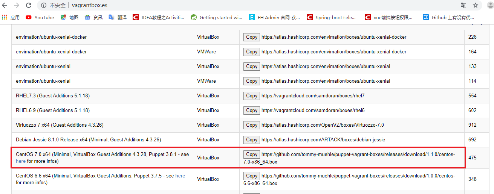

### Vagrant+VirtualBox多开虚拟机-WIN10

1. 下载并安装Vagrant，VirtualBox 

链接：https://pan.baidu.com/s/1fI2faXYpuIgroGWkH5nelQ  
提取码：e7wv  
（或者去 virtual box 和 Vagrant 官网下载 window 版本软件，并安装完毕）

2. 环境准备 

关闭 Hyper-V 的 windows 功能，中间可能需要重启系统（找不到就不管）
打开控制面板--》程序和功能--》启用或关闭windows功能


3. 使用vagrant version命令，查看vagrant是否安装成功

```
vagrant version
```
看到版本号则证明安装成功


4. 新建一个vagrant目录，区别于上面安装的vagrant安装目录

5. 使用浏览器打开官网，选择自己要下载的虚拟机版本，点击Copy

vagrantbox官网地址：http://www.vagrantbox.es/ 

我这里选择的是：CentOS 7.0 x64 (Minimal, VirtualBox Guest Additions 4.3.28, Puppet 3.8.1 - see here for more infos)



6. 在你刚才新建的vagrant目录下，执行cmd命令，执行vagrant box add 命令，把官网拷贝的地址沾在add后面


```
vagrant box add CentOS7 https://github.com/tommy-muehle/puppet-vagrant-boxes/releases/download/1.1.0/centos-7.0-x86_64.box
```

7. 等待其执行完以后，执行vagrant box list查看是否添加成功

```
vagrant box list
```

看到如下显示，证明添加成功


8. 初始化刚才添加的box

```
vagrant init CentOS7
```
出现以下提示证明初始化成功，会在该目录下生成一个Vagrantfile文件


9. 编辑Vagrantfile文件，配置多虚拟机，这里设置3个
这是虚拟机启动的配置文件，vagrantfile 的语法是 Ruby，这里配置多开虚拟机环境：

```
# -*- mode: ruby -*-
# vi: set ft=ruby :

# All Vagrant configuration is done below. The "2" in Vagrant.configure
# configures the configuration version (we support older styles for
# backwards compatibility). Please don't change it unless you know what
# you're doing.
N = [1,2,3]
VAGRANTFILE_API_VERSION = "2"
Vagrant.configure(VAGRANTFILE_API_VERSION) do |config|
# 3次遍历，创建3个虚拟机
N.each do |i|
	config.vm.define vm_name = "hbase#{i}" do |config|  # 虚拟机命名
			config.vm.provider "virtualbox" do |v|
				# 虚拟机配置信息:内存，cpu
				v.customize ["modifyvm",:id,"--name",vm_name,"--memory","1500","--cpus",2]
			end
			config.vm.box = "CentOS7"
			config.vm.hostname = vm_name
			config.ssh.username = "vagrant" # 指定要创建的虚拟机用户
			config.vm.network :private_network,ip: "192.168.56.1#{i}"
		end
	end
  # The most common configuration options are documented and commented below.
  # For a complete reference, please see the online documentation at
  # https://docs.vagrantup.com.

  # Every Vagrant development environment requires a box. You can search for
  # boxes at https://vagrantcloud.com/search.
  

  # Disable automatic box update checking. If you disable this, then
  # boxes will only be checked for updates when the user runs
  # `vagrant box outdated`. This is not recommended.
  # config.vm.box_check_update = false

  # Create a forwarded port mapping which allows access to a specific port
  # within the machine from a port on the host machine. In the example below,
  # accessing "localhost:8080" will access port 80 on the guest machine.
  # NOTE: This will enable public access to the opened port
  # config.vm.network "forwarded_port", guest: 80, host: 8080

  # Create a forwarded port mapping which allows access to a specific port
  # within the machine from a port on the host machine and only allow access
  # via 127.0.0.1 to disable public access
  # config.vm.network "forwarded_port", guest: 80, host: 8080, host_ip: "127.0.0.1"

  # Create a private network, which allows host-only access to the machine
  # using a specific IP.
  # config.vm.network "private_network", ip: "192.168.33.10"

  # Create a public network, which generally matched to bridged network.
  # Bridged networks make the machine appear as another physical device on
  # your network.
  # config.vm.network "public_network"

  # Share an additional folder to the guest VM. The first argument is
  # the path on the host to the actual folder. The second argument is
  # the path on the guest to mount the folder. And the optional third
  # argument is a set of non-required options.
  # config.vm.synced_folder "../data", "/vagrant_data"

  # Provider-specific configuration so you can fine-tune various
  # backing providers for Vagrant. These expose provider-specific options.
  # Example for VirtualBox:
  #
  # config.vm.provider "virtualbox" do |vb|
  #   # Display the VirtualBox GUI when booting the machine
  #   vb.gui = true
  #
  #   # Customize the amount of memory on the VM:
  #   vb.memory = "1024"
  # end
  #
  # View the documentation for the provider you are using for more
  # information on available options.

  # Enable provisioning with a shell script. Additional provisioners such as
  # Puppet, Chef, Ansible, Salt, and Docker are also available. Please see the
  # documentation for more information about their specific syntax and use.
  # config.vm.provision "shell", inline: <<-SHELL
  #   apt-get update
  #   apt-get install -y apache2
  # SHELL
end
```

10. 在之前打开的控制台那里执行vagrant up，启动虚拟机

```
vagrant up
```

11. 打开Oracle VM VirtualBox，可以看到刚才配置的3台虚拟机已经启动


使用XSHell进行连接，用户名是root，密码为vagrant

IP分别为:
192.168.56.11，192.168.56.12，192.168.56.13

